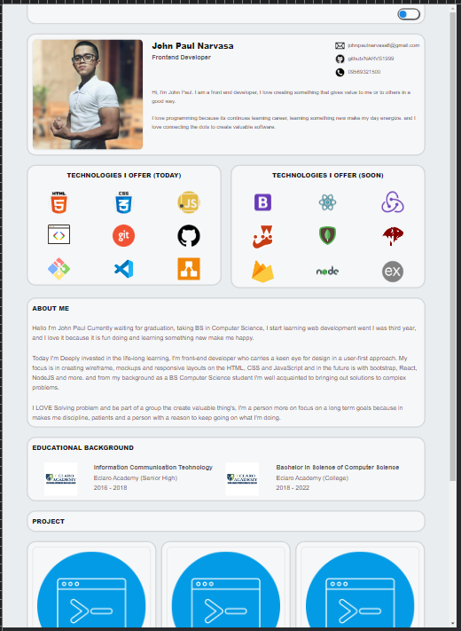
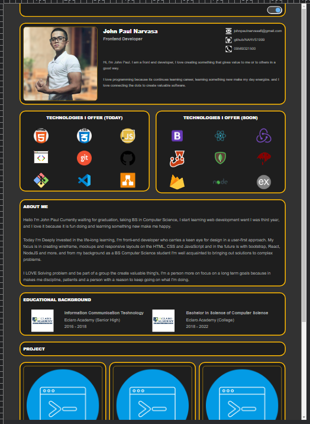
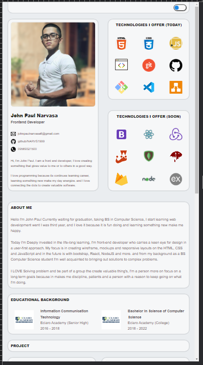
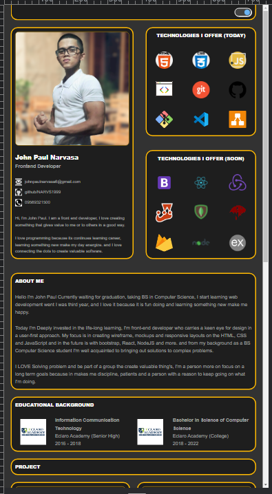
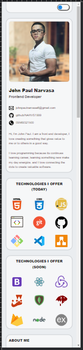
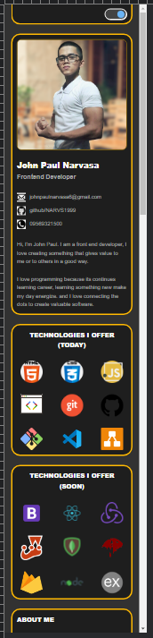

 # Portfolio

    - This project was created for my portfolio to show my work I have done in programming to other people that interested. I hope you like it.

## Wireframe:

    
## Live Demo: https://narvs1999.github.io/PORTFOLIO/

## PC View:

 

## Tablet View:

 

## Mobile View:

 

## Technology I used:
#### html5
#### css3
    grid layout
    flexbox layout
    css variable
    etc
#### javascript
    javascript DOM
    javascript event
    etc. 

## Objectives:

    1. Build a portfolio website that Responsive in
        *mobile
        *tablet
        *laptop/desktop
    2. Build a portfolio website that have a dark mode feature

## Features/Scope:
    1. responsive website
    2. (+) light mode and dark mode.
